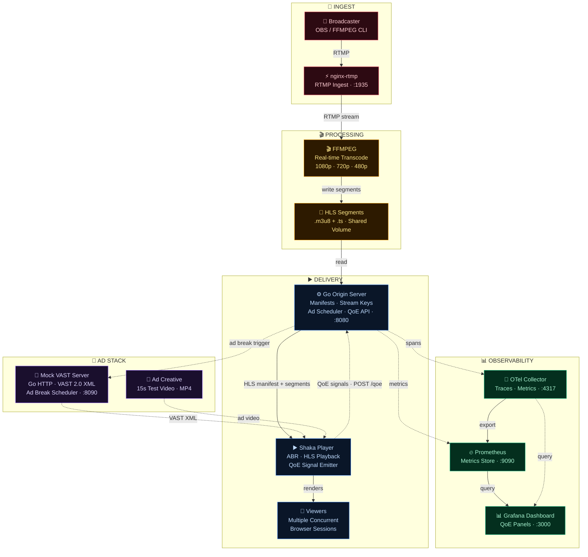

# Streamforge
Share what your heart desires

## Description
Streamforge is a live streaming infrastructure platform built from the ground up. It handles real-time RTMP ingest, adaptive multi-bitrate HLS transcoding via FFMPEG, and concurrent multi-stream delivery — all containerised and orchestrated via Docker Compose.
Beyond delivery, Streamforge includes a QoE (Quality of Experience) observability stack that collects real player-side signals such as

- startup time
- rebuffer events
- bitrate switches
- dropped frames

and surfaces them on a live Grafana dashboard via OpenTelemetry. Ad breaks are served mid-stream through a VAST-compliant mock ad server with server-side scheduling, giving the platform a complete content-to-monetisation pipeline.

## Tech Stack
- Go
- FFMPEG
- nginx-rtmp
- HLS
- Shaka Player
- OpenTelemetry
- Prometheus
- Grafana
- Docker Compose

## Architecture

## Local Setup
### Start Local Stream Ingest Server
```bash
docker compose up -d ingest-server
```
This would start the ingest server on port 1935 (RTMP).
### Start Local Stream
1. Have `ffmpeg` installed on your system.
2. Give execute permissions to the `start-stream.sh` script:
```bash
chmod +x scripts/start-stream.sh
```
3. Then run the following script to start the stream:
```bash
./scripts/start-stream.sh
```
3. When the script asks for `Stream server address: `, enter the RTMP server URL (e.g., `rtmp://localhost/live` or `rtmp://localhost:1935/live`).
4. When the script asks for `Stream key: `, enter the stream key (e.g., `test`).
5. The script will then start streaming to the specified server and key.
> WARNING: This script will start your system's default camera and microphone and stream their feed
